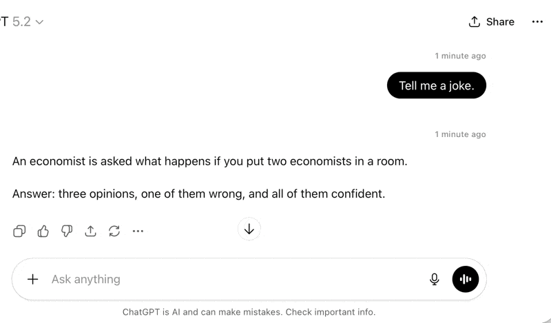

# ChatGPT Timestamps

**Finally see when your ChatGPT messages were sent.**

## Why?

ChatGPT doesn't show timestamps. That's insane. Now it does.

- Shows relative time ("2 hours ago", "yesterday")
- Hover for the exact date and time
- Subtle, non-intrusive design

## Install

1. Install a userscript manager ([Userscripts for Safari](https://apps.apple.com/us/app/userscripts/id1463298887), [Tampermonkey](https://www.tampermonkey.net/), or [Violentmonkey](https://violentmonkey.github.io/))
2. [Click here to install the script](https://raw.githubusercontent.com/mickn/chatgpt-timestamps/main/chatgpt-timestamps.user.js)
3. Done. Go to [chatgpt.com](https://chatgpt.com)

## License

MIT
